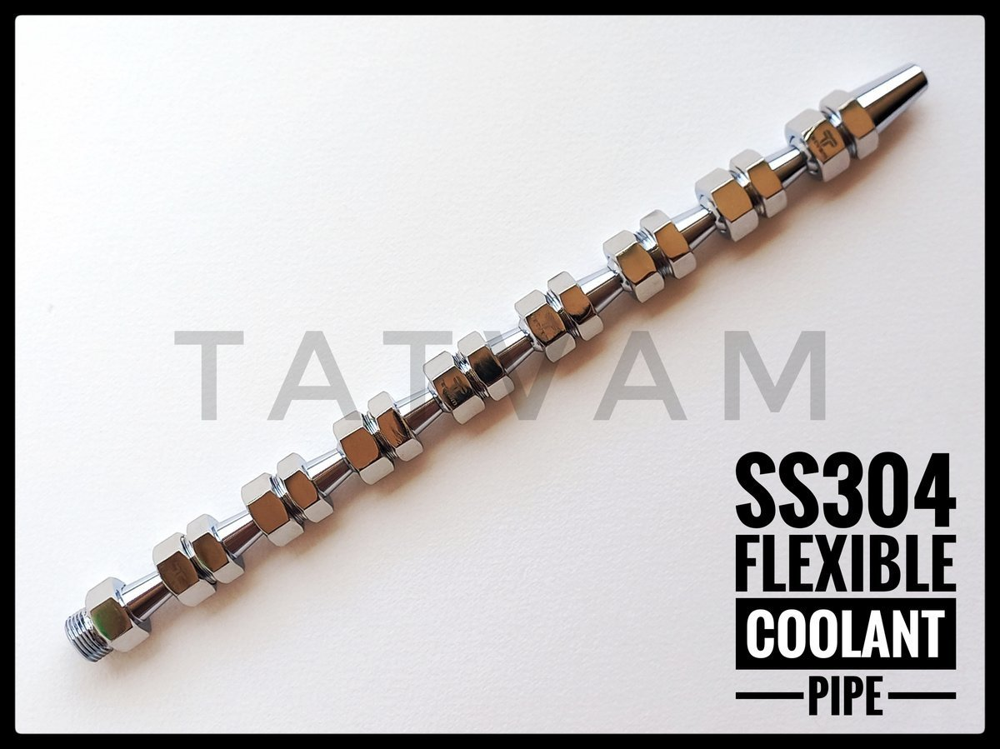

# Codebase Map: Tatvam Tools (Industrial Coolant Pipe Wholesaler)

This document provides a condensed, highly structured map of the Tatvam Tools codebase to serve as an ingestion source for NotebookLM. It details the system architecture, design tokens, HTML structure, marketing copy, and catalog data for a future Framer-inspired React/Tailwind visual redesign.

---

## Technical & Context Overview

*   **Current Architecture**: Static Multi-Page site utilizing standard HTML5 semantic elements, custom CSS variables, and Vanilla JavaScript (ES6+).
*   **Component Model**: Reusable components (`components/navbar.html`, `components/footer.html`) are injected dynamically via JavaScript on page load into matching placeholders (`#navbar-placeholder`, `#footer-placeholder`).
*   **Styling Setup**: Powered by CSS custom properties (variables) defined in `assets/css/styles.css` and component styles in `assets/css/products.css`. This CSS-based design system governs all spacings, shadows, transitions, and the industrial green/dark color scheme.
*   **Product Database**: Fully client-side JSON-like array embedded inside the scripts of `products.html`. This array drives card rendering, size/length filtering, and page detail views.

---

## 1. System & Styling Context

The styling setup relies on design tokens declared as CSS variables. The layout mixes utility variables with standard modern web layouts (Flexbox, CSS Grid).

### File: `assets/css/styles.css` (Design Tokens & Global Configuration)

```css
/* CSS Variables & Design System */
:root {
  /* Color Palette */
  --primary: #f8f9fa;             /* Light gray background */
  --primary-light: #ffffff;       /* Pure white */
  --primary-dark: #e9ecef;        /* Border gray */
  --secondary: #00a759;           /* Emerald Brand Green */
  --secondary-light: #00c96b;     /* Bright Green */
  --secondary-dark: #008847;      /* Deep Forest Green */
  --dark: #1a1a2e;                /* Midnight Blue/Dark Gray */
  --dark-light: #16213e;          /* Secondary Dark */
  
  /* Neutral Grays */
  --gray-900: #212529;
  --gray-800: #343a40;
  --gray-700: #495057;
  --gray-600: #6c757d;
  --gray-500: #adb5bd;
  --gray-400: #ced4da;
  --gray-300: #dee2e6;
  --gray-200: #e9ecef;
  --gray-100: #f8f9fa;
  
  /* Typography */
  --font-primary: "Outfit", sans-serif;
  --font-secondary: "Inter", sans-serif;
  
  /* Border Radii */
  --radius-sm: 0.375rem;
  --radius-md: 0.5rem;
  --radius-lg: 0.75rem;
  --radius-xl: 1rem;
  --radius-2xl: 1.5rem;
  --radius-full: 9999px;
  
  /* Shadows & Glows */
  --shadow-md: 0 4px 6px -1px rgba(0, 0, 0, 0.1);
  --shadow-lg: 0 10px 15px -3px rgba(0, 0, 0, 0.1);
  --shadow-xl: 0 20px 25px -5px rgba(0, 0, 0, 0.1);
  --shadow-2xl: 0 25px 50px -12px rgba(0, 0, 0, 0.25);
  --shadow-glow: 0 0 40px rgba(0, 167, 89, 0.15);
  
  /* Transitions */
  --transition-fast: 150ms ease;
  --transition-normal: 300ms ease;
}

/* Global Reset Defaults */
body {
  font-family: var(--font-secondary);
  background: var(--primary);
  color: var(--gray-800);
  line-height: 1.6;
}

.container {
  max-width: 1200px;
  margin: 0 auto;
  padding: 0 1.5rem;
}
```

### File: `assets/css/products.css` (Redesign Reference Snippet)

```css
/* Products Grid Layout */
.products-grid {
  display: grid;
  grid-template-columns: repeat(3, 1fr);
  gap: 2rem;
  margin-top: 2rem;
}

/* Product Card Styling */
.product-card {
  background: white;
  border-radius: var(--radius-xl);
  overflow: hidden;
  box-shadow: var(--shadow-md);
  border: 2px solid var(--gray-200);
  cursor: pointer;
  transition: all 0.4s cubic-bezier(0.175, 0.885, 0.32, 1.275);
}

.product-card:hover {
  transform: translateY(-12px) scale(1.02);
  box-shadow: 0 25px 50px rgba(0, 167, 89, 0.15), var(--shadow-xl);
  border-color: var(--secondary);
}

.product-card-image {
  position: relative;
  height: 250px;
  background: linear-gradient(135deg, #f8f9fa 0%, #ffffff 100%);
}

.product-card-image img {
  width: 100%;
  height: 100%;
  object-fit: contain;
  padding: 1.5rem;
}
```

---

## 2. Architecture & Layout Framework

The layout structure is divided into reusable global wrappers and page templates.

### Component: `components/navbar.html` (Header Section)

```html
<!-- Navigation -->
<header class="header">
    <nav class="navbar">
        <a href="index.html" class="logo">
            
            <span class="logo-text">Tatvam<sup>™</sup></span>
        </a>
        <ul class="nav-links">
            <li><a href="index.html" class="nav-link">Home</a></li>
            <li><a href="products.html" class="nav-link">Products</a></li>
            <li><a href="contact.html" class="nav-link">Contact</a></li>
            <li><a href="about.html" class="nav-link">About Us</a></li>
        </ul>
        <a href="contact.html" class="cta-button">Get Quote</a>
        <button class="mobile-menu-btn" aria-label="Toggle menu">
            <span></span>
            <span></span>
            <span></span>
        </button>
    </nav>
</header>
```

### Component: `components/footer.html` (Footer Section)

```html
<!-- Footer -->
<footer class="footer footer-compact">
    <div class="container">
        <!-- Brand Logo Center -->
        <div class="footer-logo-center">
            <a href="index.html" class="footer-brand-box">
                
                <span class="footer-box-text">Tatvam Tools</span>
            </a>
        </div>

        <!-- Links Grid -->
        <div class="footer-grid-3col">
            <!-- Column 1: Products -->
            <div class="footer-links footer-col-center">
                <h4>Products</h4>
                <ul>
                    <li><a href="products.html#metal-coolant-pipe">Steel Coolant Pipes</a></li>
                    <li><a href="products.html#magnet">Magnetic Holders</a></li>
                    <li><a href="products.html#mist-coolant">Mist Coolant Systems</a></li>
                    <li><a href="products.html" class="view-all-link">View All Products →</a></li>
                </ul>
            </div>

            <!-- Column 2: Company -->
            <div class="footer-links footer-col-center">
                <h4>Company</h4>
                <ul>
                    <li><a href="index.html">Home</a></li>
                    <li><a href="products.html">Products</a></li>
                    <li><a href="about.html">About Us</a></li>
                    <li><a href="contact.html">Contact</a></li>
                </ul>
            </div>

            <!-- Column 3: Contact & Reach Us -->
            <div class="footer-reach footer-col-center">
                <h4>Reach Us</h4>
                <ul>
                    <li><strong>Phone:</strong> <a href="tel:9924361415">+91 9924361415</a></li>
                    <li><strong>Email:</strong> <a href="mailto:sales@tatvamtools.com">sales@tatvamtools.com</a></li>
                    <li><strong>Address:</strong> <span>Showroom - 9, "Ram-shaym" Appartment, Gondal Road, Opp. DMart, Rajkot - 360004, Gujarat, India</span></li>
                </ul>
            </div>
        </div>

        <!-- Footer Bottom -->
        <div class="footer-bottom footer-bottom-centered">
            <div class="footer-bottom-left">
                
            </div>
            <p>&copy; 2026 Tatvam<sup>™</sup>. All rights reserved.</p>
            <div class="social-links">
                <a href="https://wa.me/919924361415" target="_blank" aria-label="WhatsApp" class="social-link whatsapp">WhatsApp Icon</a>
                <a href="https://www.youtube.com/channel/UCkxnxIjytFNpLx700yT3tMg" target="_blank" aria-label="YouTube" class="social-link youtube">YouTube Icon</a>
                <a href="https://maps.google.com/?q=22.271945,70.798444" target="_blank" aria-label="Location on Maps" class="social-link maps">Maps Icon</a>
            </div>
        </div>
    </div>
</footer>

<!-- Floating Actions -->
<div class="floating-actions">
    <a href="contact.html" class="quote-float" aria-label="Get Quote"><span class="quote-tooltip">Get Quote</span></a>
    <a href="https://wa.me/919924361415" target="_blank" class="whatsapp-float" aria-label="Chat on WhatsApp"><span class="whatsapp-tooltip">Chat on WhatsApp</span></a>
</div>
```

### File: `assets/js/script.js` (Architecture & Interaction Core)

```javascript
// Handles dynamic rendering and page utilities
const BASE_PATH = getBasePath();

// Load Navbar and Footer Components asynchronously
async function loadComponents() {
    // Fetches navbar.html and replaces #navbar-placeholder
    const navbarPlaceholder = document.getElementById('navbar-placeholder');
    if (navbarPlaceholder) {
        try {
            const response = await fetch(BASE_PATH + 'components/navbar.html');
            if (response.ok) {
                navbarPlaceholder.innerHTML = await response.text();
                initNavbar();
            }
        } catch (e) { console.log('Navbar load failed'); }
    }

    // Fetches footer.html and replaces #footer-placeholder
    const footerPlaceholder = document.getElementById('footer-placeholder');
    if (footerPlaceholder) {
        try {
            const response = await fetch(BASE_PATH + 'components/footer.html');
            if (response.ok) {
                footerPlaceholder.innerHTML = await response.text();
            }
        } catch (e) { console.log('Footer load failed'); }
    }
}

// Navigation & Spy Events
function initNavbar() {
    const mobileMenuBtn = document.querySelector('.mobile-menu-btn');
    const navLinks = document.querySelector('.nav-links');
    if (mobileMenuBtn) {
        mobileMenuBtn.addEventListener('click', function() {
            this.classList.toggle('active');
            navLinks.classList.toggle('active');
        });
    }
}
```

---

## 3. Primary Page Structure & Copy

Below is the structure and branding content extracted from the core pages.

### Page: `index.html` (Landing Page)

```html
<!-- Shell Layout -->
<!DOCTYPE html>
<html lang="en">
<head>
    <title>Tatvam™ | Stainless Steel Coolant Pipes</title>
</head>
<body>
    <div id="navbar-placeholder"></div>

    <!-- HERO SECTION -->
    <section class="hero">
        <div class="hero-content">
            <div class="hero-badge">
                <span class="badge-icon">★</span>
                <span>Premium Quality Since Excellence</span>
            </div>
            <h1 class="hero-title">
                Stainless Steel <span class="highlight">Modular Coolant</span> Pipes
            </h1>
            <p class="hero-subtitle">
                Industry-leading SS-304 modular coolant pipes engineered for precision machining applications.
                Manufactured in-house with rigorous quality control, our pipes deliver superior leak-proof
                performance across CNC, VMC, Lathe, Milling, Grinding & Shaping operations.
            </p>
            <div class="hero-cta">
                <a href="products.html" class="btn-primary">Explore Products</a>
                <a href="contact.html" class="btn-secondary">Contact Us</a>
            </div>
            <!-- Performance Stats -->
            <div class="hero-stats">
                <div class="stat-item"><span class="stat-number">100</span><span class="stat-label">Bar Pressure</span></div>
                <div class="stat-item"><span class="stat-number">300°C</span><span class="stat-label">Working Temp</span></div>
                <div class="stat-item"><span class="stat-number">SS-304</span><span class="stat-label">Material</span></div>
            </div>
        </div>
        <div class="hero-image">
            
        </div>
    </section>

    <!-- FEATURES SECTION -->
    <section class="features" id="features">
        <div class="container">
            <div class="section-header">
                <span class="section-tag">Why Choose Us</span>
                <h2>Built for <span class="highlight">Industrial Excellence</span></h2>
                <p>Our coolant pipes are engineered to meet the demanding requirements of modern machining operations</p>
            </div>
            <div class="features-grid">
                <div class="feature-card">
                    <h3>Superior Durability</h3>
                    <p>Premium-grade steel construction engineered to withstand rigorous industrial conditions, delivering reliable performance and extended operational lifespan</p>
                </div>
                <div class="feature-card">
                    <h3>High Performance</h3>
                    <p>Withstands up to 50 bar pressure and 90°C working temperature for demanding applications</p>
                </div>
                <div class="feature-card">
                    <h3>Flexible Design</h3>
                    <p>Highly flexible construction allows easy positioning and adjustment for optimal coolant flow</p>
                </div>
                <div class="feature-card">
                    <h3>Quality Assured</h3>
                    <p>Tatvam Tools certified products with superior coating for premium quality assurance</p>
                </div>
            </div>
        </div>
    </section>

    <!-- APPLICATIONS GRID -->
    <section class="applications">
        <div class="container">
            <div class="section-header">
                <span class="section-tag">Applications</span>
                <h2>Industrial <span class="highlight">Applications</span></h2>
                <p>Our coolant pipes are designed for a wide range of industrial machinery</p>
            </div>
            <div class="applications-grid">
                <div class="application-item"><span>CNC Machines</span></div>
                <div class="application-item"><span>VMC Machines</span></div>
                <div class="application-item"><span>Lathe Machines</span></div>
                <div class="application-item"><span>Milling Machines</span></div>
                <div class="application-item"><span>Shaping Machines</span></div>
            </div>
        </div>
    </section>

    <!-- CTA SECTION -->
    <section class="cta-section">
        <div class="cta-content">
            <h2>Ready to Upgrade Your Machine Coolant System?</h2>
            <p>Get in touch with us today for competitive pricing and bulk orders</p>
            <div class="cta-buttons">
                <a href="contact.html" class="btn-primary">Get a Quote</a>
                <a href="tel:9924361415" class="btn-secondary">Call Now</a>
            </div>
        </div>
    </section>

    <div id="footer-placeholder"></div>
</body>
</html>
```

### Page: `about.html` (Corporate Context)

```html
<!DOCTYPE html>
<html lang="en">
<head>
    <title>About Us | Tatvam™ - Industrial Tools Distributor</title>
</head>
<body>
    <div id="navbar-placeholder"></div>

    <section class="contact-hero">
        <h1>About <span class="highlight">Tatvam Tools</span></h1>
        <p>Established in 2014, distributing high-quality industrial tools and components</p>
    </section>

    <section class="about-section">
        <h2>Company <span class="highlight">Overview</span></h2>
        <p>Established in 2014 and headquartered in Rajkot, Gujarat, Tatvam Tools has rapidly emerged as a leader in the distribution of high-quality industrial tools and components. We specialize in providing Plastic Flexible Coolant Pipes and Polyurethane Dead Blow Hammers, catering to a diverse range of industries.</p>
        <p>Our commitment to quality, innovation, and customer satisfaction has made us a trusted partner for businesses seeking reliable industrial solutions.</p>
    </section>

    <section class="vision-mission-section">
        <h2>Vision & <span class="highlight">Mission</span></h2>
        <div class="vm-grid">
            <div class="vm-card">
                <h3>Our Vision</h3>
                <p>To be the leading distributor of innovative and high-quality industrial tools and components, empowering industries to achieve optimal efficiency and performance through our reliable and advanced solutions.</p>
            </div>
            <div class="vm-card">
                <h3>Our Mission</h3>
                <p>At Tatvam Tools, our mission is to provide exceptional value to our customers by delivering top-tier products and unparalleled service. We are dedicated to fostering long-term relationships with our clients by consistently meeting their evolving needs and exceeding their expectations.</p>
            </div>
        </div>
    </section>

    <section class="values-section">
        <h2>Our <span class="highlight">Values</span></h2>
        <ul>
            <li><strong>Integrity:</strong> We conduct our business with the highest ethical standards, ensuring transparency, honesty, and accountability in all our interactions.</li>
            <li><strong>Quality:</strong> We are committed to providing superior products and services that meet the highest standards of excellence and reliability.</li>
            <li><strong>Innovation:</strong> We continuously seek innovative solutions and embrace new technologies to meet the changing needs of our customers and stay ahead in the industry.</li>
            <li><strong>Customer Focus:</strong> We prioritize our customers' needs and strive to build strong, lasting relationships by delivering exceptional service and support.</li>
        </ul>
    </section>

    <section class="history-section">
        <h2>Our <span class="highlight">History</span></h2>
        <h3>Founding</h3>
        <p>Tatvam Tools was founded in 2014 with a vision to become a premier distributor of industrial tools and components. With extensive experience in the industrial sector, we aim to address the growing demand for high-quality products in the market.</p>
        <div class="history-stats">
            <div><span>2014</span> Year Founded</div>
            <div><span>10+</span> Years Experience</div>
            <div><span>500+</span> Happy Clients</div>
        </div>
    </section>

    <div id="footer-placeholder"></div>
</body>
</html>
```

### Page: `contact.html` (Lead Acquisition)

```html
<!DOCTYPE html>
<html lang="en">
<head>
    <title>Contact Us | Tatvam™ - Metal Coolant Pipes</title>
</head>
<body>
    <div id="navbar-placeholder"></div>

    <section class="contact-hero">
        <h1>Get in <span class="highlight">Touch</span></h1>
        <p>Have questions about our products? Need a quote for bulk orders? We're here to help.</p>
    </section>

    <section class="contact-section">
        <!-- Lead details -->
        <div class="contact-info">
            <h2>Contact Information</h2>
            <p>sales@tatvamtools.com</p>
            <p>+91 9924361415 (WhatsApp Available)</p>
            <p>Ground Floor, Shop No 9, Ram-shaym Appartment, Opp D-mart, Rajkot - 360004, Gujarat, India</p>
        </div>

        <!-- Interactive Lead Form (B2B Redesign Target) -->
        <form id="contactForm">
            <input type="text" name="name" placeholder="Full Name *" required>
            <input type="email" name="email" placeholder="Email Address *" required>
            <input type="tel" name="phone" placeholder="Phone Number">
            <select name="subject" required>
                <option value="quote">Request a Quote</option>
                <option value="product">Product Inquiry</option>
                <option value="bulk">Bulk Order</option>
                <option value="support">Technical Support</option>
            </select>
            <select name="product">
                <option value="steel-coolant-pipe">Steel Flexible Coolant Pipe</option>
                <option value="plastic-coolant-pipe">Plastic Flexible Coolant Pipe (KRC)</option>
                <option value="magnetic-base">Magnetic Base Coolant Hose Holder</option>
                <option value="circular-flow">Circular Flow Coolant Pipe</option>
                <option value="mist-coolant">Mist Coolant System</option>
                <option value="elements">Coolant Pipe Elements</option>
                <option value="pu-hammer">PU Hammer</option>
            </select>
            <textarea name="message" placeholder="Tell us about your requirements..." required></textarea>
            <button type="submit">Send Message</button>
        </form>
    </section>

    <div id="footer-placeholder"></div>
</body>
</html>
```

---

## 4. Product Catalog Data (Ingestion Model)

*Note: Truncated redundant size-based image list combinations (e.g., hundreds of files containing `1-4/1-4x10/img.jpg`), keeping the structural array schema, specifications, descriptions, and metadata.*

### Embedded Database: `products` Array (JSON format representation)

```json
[
  {
    "id": "ss-coolant-pipe",
    "name": "Stainless Steel Coolant Pipe",
    "shortDesc": "Premium SS-304 stainless steel coolant pipe",
    "badge": "New Arrival",
    "folder": "SS-metal-coolant-pipe",
    "coverImage": "20260519_131127.jpeg",
    "video": "VIDEO_5e07b2e1-9a1a-4c2c-83a4-0a4c71c673cf.mp4",
    "specs": [
      { "label": "Material", "value": "Stainless Steel-304" },
      { "label": "Brand", "value": "Tatvam" },
      { "label": "Thread Sizes", "value": "3/8\" BSP" },
      { "label": "Standard Length", "value": "12\" (Customizable)" },
      { "label": "Key Feature", "value": "Adjustable & Leak-proof" },
      { "label": "Parts Available", "value": "Separately Purchasable" },
      { "label": "Temperature Resistance", "value": "Up to 300°C" },
      { "label": "Pressure Resistance", "value": "Up to 100 Bar" }
    ],
    "description": "Discover the ultimate reliability in coolant delivery with the Tatvam™ Stainless Steel Modular Coolant Pipe. Engineered from premium SS-304 stainless steel and designed without seal rings, our jointed hose system guarantees an exceptionally long service life and uncompromising performance in the harshest industrial environments. Each component is precision-manufactured to be highly resistant to extreme temperatures, harsh chemical substances, flying chips, and intense machine vibrations. Designed for maximum versatility, the Tatvam coolant system can be effortlessly adjusted, extended, or shortened by hand to suit your exact requirements. Once positioned, the screwable jet remains rigidly fixed—neither high coolant pressure nor heavy machine vibrations will misalign it. This eliminates the common pitfalls of standard plastic hoses, ensuring your coolant always reaches precisely where it is needed, thereby preventing expensive tool damage and costly machine downtime. Our advanced design also optimizes flow efficiency, reducing the workload on your pumps. This translates directly to lower energy consumption and decreased operational costs. Perfectly suited for emulsions, cutting oils, chemical fluids, and air cooling, it is the ideal upgrade for CNC centers, VMCs, turning machines, milling machines, grinding equipment, sawing plants, and food-grade machinery. Maximize your productivity and extend your tool lifespan with Tatvam's premium, highly durable stainless steel coolant solution."
  },
  {
    "id": "metal-coolant-pipe",
    "name": "Steel Flexible Coolant Pipe",
    "shortDesc": "Precision-engineered steel coolant pipes for industrial applications",
    "badge": "Best Seller",
    "folder": "metal-coolant-pipe",
    "coverImage": "metal-coolant-pipe(cover).jpg",
    "specs": [
      { "label": "Material", "value": "Steel" },
      { "label": "Brand", "value": "Tatvam" },
      { "label": "Thread Sizes", "value": "¼\", ⅜\", ½\" BSP" },
      { "label": "Standard Length", "value": "12\" (Customizable)" },
      { "label": "Key Feature", "value": "Adjustable & Leak-proof" },
      { "label": "Parts Available", "value": "Separately Purchasable" }
    ],
    "description": "Engineered for industrial excellence, our Steel Flexible Coolant Pipes represent the pinnacle of precision coolant delivery technology. Manufactured in-house under stringent quality control protocols, these pipes feature premium-grade steel construction rated for 50+ bar operating pressure and 90°C maximum working temperature. The innovative flexible segment design ensures zero-leak performance while enabling precise directional coolant flow optimization. Modular architecture allows individual procurement of Part Elements, Threaded Adapters (BSP standard), and specialized Nozzles for complete system customization. Trusted by manufacturing facilities nationwide, our coolant pipes deliver exceptional performance across CNC machining centers, VMC units, conventional Lathes, Milling machines, Surface Grinders, Drilling equipment, Boring machines, EDM systems, and Shaping operations. Backed by Tatvam Tools' commitment to quality and comprehensive after-sales support."
  },
  {
    "id": "magnet",
    "name": "Magnetic Base Coolant Hose Holder",
    "shortDesc": "Powerful magnetic base with flexible coolant nozzles",
    "badge": "New Arrival",
    "folder": "magnet",
    "coverImage": "magnet-front.jpg",
    "video": "Magnet-round-view(video).mp4",
    "specs": [
      { "label": "Magnetic Pull", "value": "100 lbs" },
      { "label": "Brand", "value": "Tatvam" },
      { "label": "Base Type", "value": "On-Off Magnetic Base" },
      { "label": "Nozzle Count", "value": "2 Flexible Nozzles" },
      { "label": "Nozzle Size", "value": "¼\" BSP" },
      { "label": "Key Feature", "value": "Strong Holding Power" }
    ],
    "description": "The Coolant Flexible Magnetic Base Hoses Holder is designed for maximum versatility and convenience in industrial machining applications. Featuring a powerful 100 lbs magnetic pull, it quickly attaches to any metallic surface with exceptional holding power. The innovative on-off magnetic base allows for easy repositioning without scratching your workpiece or machine surface. Equipped with 2 flexible coolant nozzles measuring ¼\" BSP, these hoses stay put in any position, directing coolant exactly where needed. Perfect for CNC machines, lathes, milling machines, grinders, and other metalworking equipment. The magnetic base design eliminates the need for additional mounting hardware, making it ideal for temporary setups or frequently changing production requirements."
  },
  {
    "id": "coolant-pipe",
    "name": "Plastic Flexible Coolant Pipe",
    "shortDesc": "High-quality PP coolant pipes for versatile applications",
    "badge": "Popular",
    "folder": "Coolant-Pipe",
    "coverImage": "AQ-121908413-1-2-inch-y-coolant-pipe.jpeg",
    "sizes": ["1/4", "3/8", "1/2", "3/4"],
    "lengths": ["2", "4", "6", "8", "10", "12", "18", "24", "30"],
    "specs": [
      { "label": "Material", "value": "PP++" },
      { "label": "Brand", "value": "KRC" },
      { "label": "Thread Sizes", "value": "⅛\", ¼\", ⅜\", ½\", ¾\" BSP" },
      { "label": "Shapes", "value": "Straight, Y-shaped" },
      { "label": "Nozzle Options", "value": "Round / Flat" },
      { "label": "Key Feature", "value": "Adjustable & Leak-proof" },
      { "label": "Custom Length", "value": "Available on Request" }
    ],
    "description": "Adjustable, leak-proof pipes and fittings ensure precise coolant flow for machining and industrial applications. Made from high-quality PP (Polypropylene) material, offering excellent chemical resistance, flexibility and durability. Our plastic coolant pipes are designed for applications requiring lightweight construction with superior corrosion resistance. Available in multiple thread sizes and lengths, these pipes maintain their shape while allowing easy directional adjustments. Ideal for light-duty machining operations, laboratory equipment, and environments where chemical resistance is critical."
  },
  {
    "id": "y-coolant-pipe",
    "name": "Plastic Y-Coolant Pipe",
    "shortDesc": "Premium plastic Y-coolant pipes with dual output nozzles",
    "badge": "New Arrival",
    "folder": "Y-Coolant-Pipe",
    "coverImage": "1-4/Y - 1-4x12/20260610_162136.jpeg",
    "sizes": ["1/4", "3/8", "1/2"],
    "lengths": ["6", "12", "12 (6x6x6)", "18"],
    "specs": [
      { "label": "Material", "value": "PP++" },
      { "label": "Brand", "value": "KRC" },
      { "label": "Thread Sizes", "value": "⅛\", ¼\", ⅜\", ½\" BSP" },
      { "label": "Shapes", "value": "Straight, Y-shaped" },
      { "label": "Nozzle Options", "value": "Round / Flat" },
      { "label": "Key Feature", "value": "Adjustable & Leak-proof" },
      { "label": "Custom Length", "value": "Available on Request" }
    ],
    "description": "Adjustable, leak-proof Y-coolant pipes and fittings ensure precise, dual-directional coolant flow for machining and industrial applications. This product features a single input thread dividing into two separate flexible output nozzle segments, allowing targeted cooling at two distinct points of operation simultaneously. Made from high-quality PP (Polypropylene) material, offering excellent chemical resistance, flexibility, and durability."
  },
  {
    "id": "jeton-coolant-pipe",
    "name": "Jeton Coolant Pipe",
    "shortDesc": "Premium Jeton adjustable plastic coolant pipes",
    "badge": "Premium",
    "folder": "Jeton-Coolant-Pipe",
    "coverImage": "1-4/1-4x12/20260612_154757.jpeg",
    "sizes": ["1/4", "3/8", "1/2"],
    "lengths": ["6", "12", "18", "24"],
    "specs": [
      { "label": "Material", "value": "Acetal Copolymer (POM)" },
      { "label": "Brand", "value": "Jeton" },
      { "label": "Thread Sizes", "value": "¼\", ⅜\", ½\" BSP" },
      { "label": "Shapes", "value": "Straight, Y-shaped" },
      { "label": "Nozzle Options", "value": "Round / Flat" },
      { "label": "Key Feature", "value": "High Rigidity & Chemical Resistance" },
      { "label": "Custom Length", "value": "Available on Request" }
    ],
    "description": "Made using superior POM plastic steel, Jeton Coolant Pipes are strongly resistant to oils, chemicals, and industrial solvents. The adjustable coolant hose is highly pliable, allowing it to hold its shape perfectly without springing back. Bending the hose will not reduce its inner diameter, and it will not pinch or fatigue over time. In addition, the adjustable coolant hose will not damage cutting blades if there is accidental contact. Being non-conductive, it does not conduct electricity and is highly suitable for use on electrical discharge (EDM) machines. Designed specifically for the transport of low-pressure fluids, Jeton coolant pipes are available in both Straight and Y-shaped configurations to suit diverse machining setups."
  },
  {
    "id": "circular-flow",
    "name": "Circular Flow Coolant Pipe",
    "shortDesc": "Specialized circular nozzle for 360° coolant distribution",
    "badge": "Premium",
    "folder": "Circular-Flow-Coolant-Pipe",
    "coverImage": "Circular-Flow-Nozzle-Coolant-Pipe.jpg",
    "specs": [
      { "label": "Material", "value": "PP++" },
      { "label": "Thread Sizes", "value": "¼\", ½\" BSP" },
      { "label": "Flow Type", "value": "360° Circular" },
      { "label": "Application", "value": "CNC, VMC, Lathe, Milling, Grinding, EDM, Drilling" },
      { "label": "Key Feature", "value": "Uniform Coolant Distribution" }
    ],
    "description": "Introducing our premium Circular Flow Coolant Pipe, engineered to deliver unparalleled 360-degree coolant distribution for precision machining applications. This innovative nozzle design ensures uniform coolant coverage around the entire cutting zone, significantly improving tool life and surface finish quality. Ideal for high-speed CNC machining centers, VMC operations, and applications where conventional directional nozzles fall short. The circular flow pattern eliminates hot spots, reduces thermal shock, and maintains consistent chip evacuation during demanding machining operations. Manufactured with industrial-grade materials for exceptional durability and corrosion resistance. Available in multiple sizes to accommodate various spindle configurations and flow requirements. Trusted by precision manufacturing facilities for operations requiring superior thermal management and extended tool longevity."
  },
  {
    "id": "mist-coolant",
    "name": "Mist Coolant System",
    "shortDesc": "Advanced mist coolant delivery for precision cooling",
    "badge": "Advanced",
    "folder": "Mist-Coolant",
    "coverImage": "20250618_181305.jpg",
    "specs": [
      { "label": "Type", "value": "Mist Spray System" },
      { "label": "Brand", "value": "Tatvam" },
      { "label": "PU Pipe Size", "value": "8mm Outer Diameter" },
      { "label": "Coolant Type", "value": "Air + Coolant Mix" },
      { "label": "Application", "value": "High-Speed Machining" },
      { "label": "Key Feature", "value": "Minimal Coolant Usage" },
      { "label": "Adjustable", "value": "Flow Rate Control" }
    ],
    "description": "Experience the next generation of coolant delivery with our advanced Mist Coolant System. This state-of-the-art system atomizes coolant into a fine mist, combining air and coolant to create an optimal cooling environment for high-speed machining operations. The mist coolant technology dramatically reduces coolant consumption by up to 90% compared to traditional flood cooling methods, while providing superior cooling efficiency at the cutting edge. Features precision-adjustable flow rate control for customizing coolant delivery based on specific machining requirements. The system is particularly effective for aluminum machining, dry machining applications, and operations where minimal coolant usage is preferred. Includes industrial-grade components for reliable performance in demanding production environments. Easy installation and low maintenance make it an ideal upgrade for modern manufacturing facilities seeking to optimize coolant usage and improve machining efficiency."
  },
  {
    "id": "elements",
    "name": "Coolant Pipe Elements",
    "shortDesc": "Individual flexible pipe segments for custom assemblies",
    "badge": "Essential",
    "folder": "Elements",
    "coverImage": "1000103933-01 (1).jpeg",
    "specs": [
      { "label": "Type", "value": "Flexible Elements" },
      { "label": "Brand", "value": "KRC" },
      { "label": "Thread Sizes", "value": "⅛\", ¼\", ⅜\", ½\", ¾\" BSP" },
      { "label": "Material", "value": "PP++" },
      { "label": "Compatibility", "value": "Universal Fit" },
      { "label": "Key Feature", "value": "Modular Assembly" }
    ],
    "description": "Our Coolant Pipe Elements are the fundamental building blocks for creating custom coolant delivery systems tailored to your specific machining requirements. Each element is precision-manufactured from high-quality polymer material that offers excellent chemical resistance, flexibility, and long-term durability. The modular design allows you to create coolant pipes of any length by simply connecting multiple elements together, providing unlimited flexibility for unique machine configurations. Universal compatibility ensures seamless integration with both our steel and plastic coolant pipe systems. Available in various segment sizes to accommodate different flow requirements and installation spaces. Sold individually or in bulk quantities for cost-effective inventory management. These essential components are the perfect solution for replacement parts, custom assemblies, or building new coolant systems from scratch. Backed by Tatvam Tools quality assurance for consistent performance and reliability."
  },
  {
    "id": "spout-assembly",
    "name": "Spout Assembly",
    "shortDesc": "Complete spout assembly for coolant pipe systems",
    "badge": "Complete Kit",
    "folder": "Spout-Assembly",
    "coverImage": "20251204_161517.jpg",
    "specs": [
      { "label": "Type", "value": "Complete Assembly" },
      { "label": "Includes", "value": "Spout + Fittings" },
      { "label": "Material", "value": "MS Grade" },
      { "label": "Key Feature", "value": "Ready to Install" }
    ],
    "description": "The complete Spout Assembly from Tatvam Tools provides everything you need for professional coolant pipe installation in a single, ready-to-install package. This comprehensive kit includes precision-machined spout components and all necessary fittings, eliminating the hassle of sourcing individual parts. Manufactured with industrial-grade materials to withstand the demanding conditions of machining environments, including coolant exposure, temperature variations, and continuous vibration. Features standard BSP threading for universal compatibility with most machine tool coolant systems. The ergonomic spout design enables precise coolant direction adjustment while maintaining a secure, leak-proof connection. Ideal for new installations, system upgrades, or replacement of worn components. Quality-tested at our facility to ensure reliable performance from day one. Available in multiple thread sizes to accommodate various machine requirements. The perfect solution for maintenance professionals and machine builders seeking reliable, high-quality coolant system components."
  },
  {
    "id": "pu-hammer",
    "name": "PU Hammer",
    "shortDesc": "High-quality polyurethane hammer for industrial use",
    "badge": "Tool",
    "folder": "PU-Hammer",
    "coverImage": "PU-Hammer(Orange).PNG",
    "specs": [
      { "label": "Type", "value": "PU Hammer" },
      { "label": "Models", "value": "Dead Blow, Soft Face, Flexible" },
      { "label": "Head Diameter", "value": "25mm, 40mm, 50mm, 65mm" },
      { "label": "Material", "value": "Polyurethane Head" },
      { "label": "Handle", "value": "Ergonomic Grip" },
      { "label": "Key Feature", "value": "Longer Working Life" }
    ],
    "description": "The PU Hammer represents the pinnacle of industrial hand tool engineering, designed for applications requiring controlled striking force without surface damage. Available in three specialized models - Dead Blow for maximum impact absorption, Soft Face for delicate surfaces, and Flexible for versatile applications. The premium polyurethane head delivers powerful impact while protecting delicate workpieces, polished surfaces, and precision components from marring, denting, or scratching. Ideal for assembly operations, machinery installation, positioning of components, and applications where traditional metal hammers would cause damage. The ergonomically designed handle provides exceptional grip comfort and reduces operator fatigue during extended use. Available in multiple weight configurations to suit various applications, from light-duty assembly work to heavy-duty industrial positioning tasks. The high-quality polyurethane head material offers excellent durability and consistent rebound characteristics, maintaining its shape and performance over thousands of impacts. A essential tool for machine shops, assembly lines, maintenance operations, and precision manufacturing facilities where workpiece integrity is paramount."
  }
]
```
